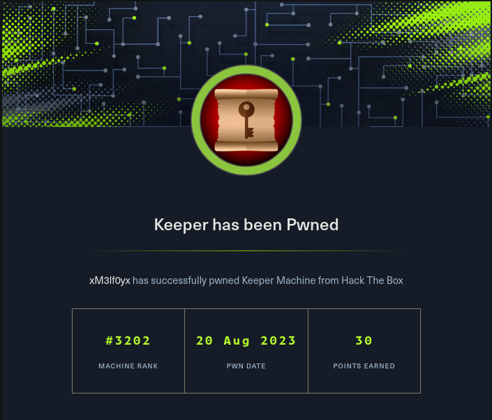
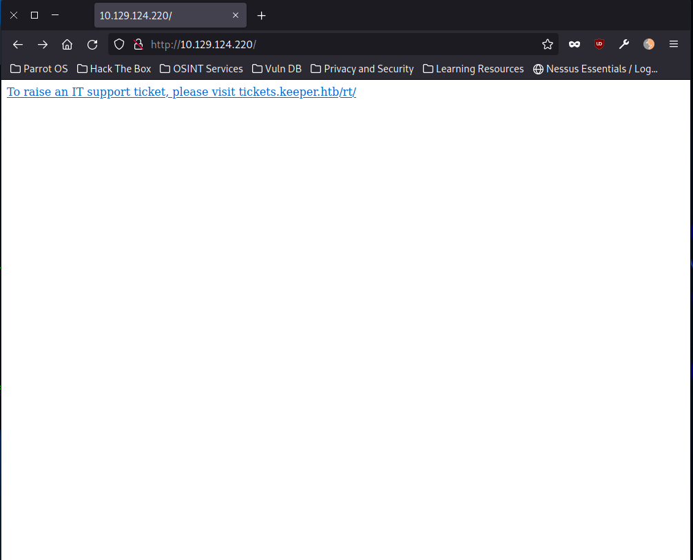
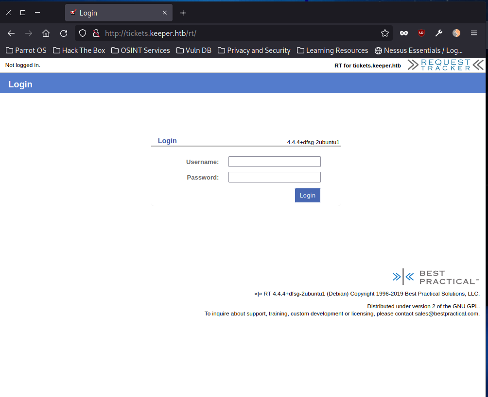
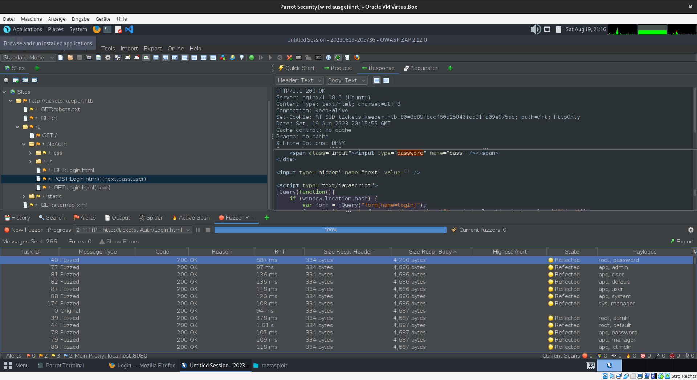
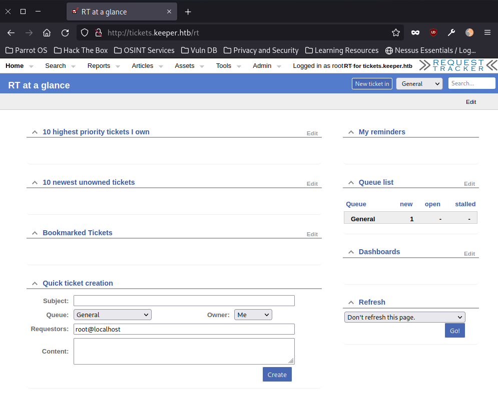
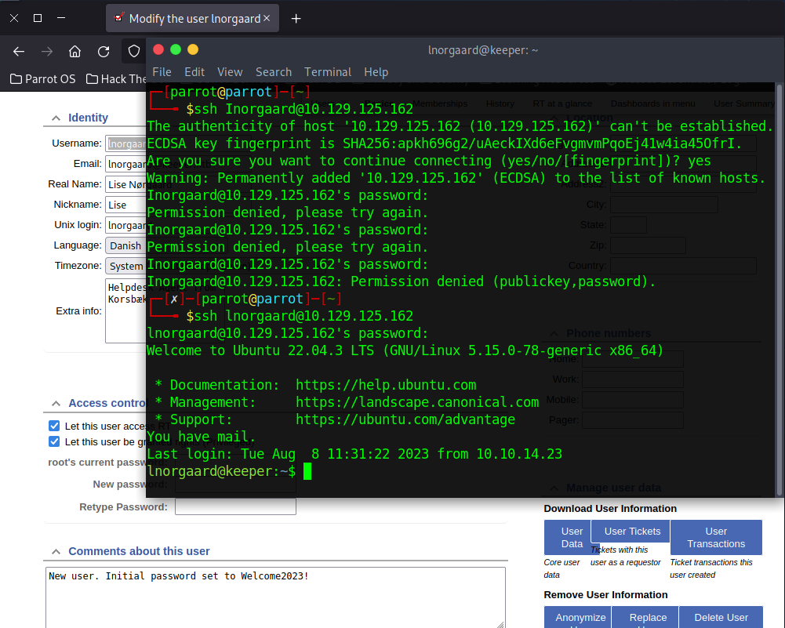
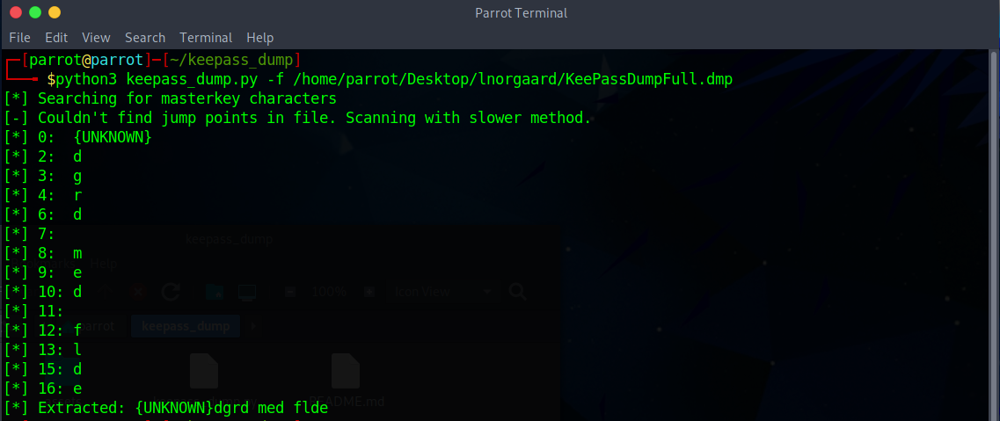
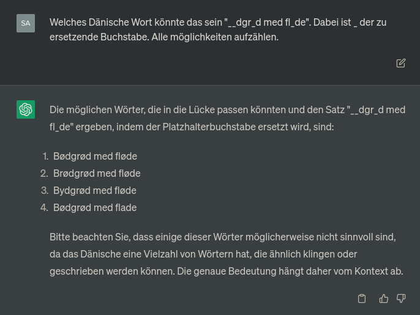
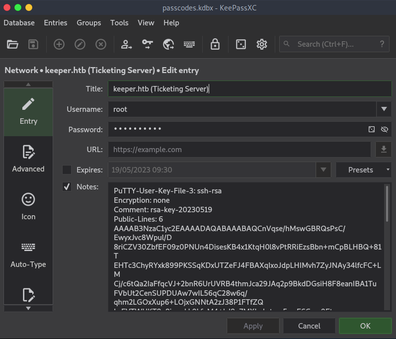

# Keeper

## Overview

Keeper ist eine Saisonale Maschine die in der Open Beta Season II gespielt wurde. Keeper wurde am 12. August 2023 veröffentlicht. 

> OS : Linux
> Points: 20




## Recherche (Reconnaissance)

### Nmap Port-Scan

Zuerst wurde ein umfassender Port-Scan mit dem Nmap-Tool durchgeführt. Der Befehl für das Scannen aller Ports der Ziel-IP-Adresse lautete:

```bash
nmap -p- IP_ADRESS
```

Das Ziel dieses Scans war es, alle offenen Ports auf dem Zielsystem zu identifizieren, die Hinweise auf die laufenden Dienste und potenzielle Angriffsvektoren liefern könnten.
### Scan-Ergebnisse

Hier ist eine Zusammenfassung der offenen Ports, die während des Nmap-Scans entdeckt wurden:

- Port 22: SSH (Secure Shell)
- Port 80: HTTP (Hypertext Transfer Protocol)





Nach der Identifizierung der offenen Ports wurde ein Webbrowser geöffnet, um die erreichbaren Webseiten zu erkunden. Dabei wurde festgestellt, dass es einen Verweis auf `tickets.keeper.htb/rt` gibt. Um darauf zuzugreifen, wurde die Datei `/etc/hosts` bearbeitet:

```bash
sudo su
echo "IP_ADRESS    tickets.keeper.htb" > /etc/hosts
```



Anschließend wurde eine Anmeldeseite entdeckt. Bevor jedoch die Seite analysiert wurde, wurde ein Skript-Scan auf den gefundenen Ports mit folgendem Befehl durchgeführt:

```bash
nmap -sC -sV -O -p22,80 IP_ADRESS
```
> Dieser Scan hat auch keine Zielführende Informationen gegeben.

Nach einer sorgfältigen Prüfung der Webseite wurde festgestellt, dass sie auf ungewöhnliche Unterverzeichnisse verweist. Durch die Anwendung des Tools "gobuster" wurde eine Untersuchung verschiedener Unterverzeichnisse durchgeführt. Dabei wurden Fehler geworfen, da bei jeder Anfrage der Server mit unterschiedlichen Fehlern Antwortete und verwies auf randomisierte Unterverzeichnisse. Der Seitenquelltext und eine mögliche SQL-Injektion Schwachstellen zu identifizieren wurde versucht. Hierbei kam auch das Tool "sqlmap" zum Einsatz, ohne Erfolg.

Trotz diverser Herangehensweisen erwiesen sich diese Bemühungen als ergebnislos. Infolgedessen wurde das Tool OWASP-ZAP verwendet, um weitere Schwachstellen zu erkennen. Allerdings konnte keine bedeutende Schwachstelle gefunden werden, die ausgenutzt werden könnte.

Daraufhin wurde die Entscheidung getroffen, einen Brute-Force-Angriff auf die Benutzernamen und Passwörter zu versuchen. Dabei bot sich die Nutzung von OWASP-ZAP an, um diesen Angriff einfach durchzuführen. Die Wahl fiel auf die Metasploit-Wordliste, die im Verzeichnis `/usr/share/wordlists/metasploit/http_default_users.txt` und  `/usr/share/wordlists/metasploit/http_default_pass.txt`verfügbar ist.

Das Ergebnis des Brute Force Angriffs mit dem OWASP-ZAP Fuzzer gab nach kürzester Zeit einen Treffer:`root:password`



Nach erfolgreicher Anmeldung mit den bereitgestellten Anmeldedaten wurde nach begutachten der Seite ein Benutzer `longaard` gefunden, bei den Kommentaren über diesen Benutzer stand, dass neue Benutzer das Passwort `Welcome2023!` bekommen.





Nach dem Anmelden über ssh bekommen wir unsere erste flag:
```bash
lnorgaard@keeper:/home$ cd lnorgaard/
lnorgaard@keeper:~$ ls
RT30000.zip  user.txt
lnorgaard@keeper:~$ cat user.txt
e47fexxxxxxxxxxxxxxxxxxxxxxxxxxxxxxx
```

`RT30000.zip` klingt interessant, beim Entpacken kam KeepassDumFull.dmp und passcodes.kdbx heraus.

Ich kopierte mir den Ordner auf mein System mit dem Befehl:
```bash
scp -r lnorgaard@IP_ADRESS:/home/lnorgaard /home/parrot/Desktop/
```


Die Situation erinnerte mich kürzlich an eine ähnliche Schwachstelle, die ich während des CTFs "Deutschlands Bester Hacker" gelöst hatte. In diesem Moment war mir klar, dass es sich um die Schwachstelle mit der Kennung (CVE-2023-32784) handeln musste.


Also downloadete ich das Python Programm, dass es mir ermöglichte das Passwort mit Ausnahmen zu extrahieren und führte es aus wie folgt aus:

```bash
git clone https://github.com/z-jxy/keepass_dump.git
cd keepass_dump/
# Das Programm wird ausgeführt mit
python3 keepass_dump.py -f DUMP_FILE

```



Das Passwort lautet also: `__dgr_d med fl_de` 
Mein erster Gedanke war, dass das Erraten des Passworts mit Hashcat eine ziemlich schwierige Aufgabe sein würde. Doch dann kam mir die Idee, noch einmal genauer auf die Landessprache zu schauen, die vorher beim Benutzer `lnorgaard` vermerkt war, und die mir zuerst nichts sagte. Ich kopierte den Text und fand heraus, dass es sich um Dänisch handelte, wie mir Google Translate bestätigte.

Daraufhin entschied ich mich, ChatGPT um Rat zu fragen, ob es ein ähnliches dänisches Wort kannte. Vielleicht konnte es mir helfen, eine mögliche Verbindung zu finden:
Google fand zwar kein `Bødgrød med fløde`, dazu aber `rødgrød med fløde`



Dieses im KeepassXC eingetippt und es öffnete sich.


Weiter zu root navigieren und das Passwort war `F4><3K0nd!`, dies sah nach einem Falschen Passwort aus, trotzdem wurde es versucht, ohne Erfolg.




Wie wir sehen ist das eine PuTTY-User-Key-File. Nach einer Recherche müssen wir diese Notiz kopieren und in eine key.ppk Datei speichern. Dannach den folgenden Befehl eintippen `puttygen key.ppk -O private-openssh -o pem-key.pem`

Aber Achtung, dies hat eine Weile gedauert, da Putty in APT in der Version 0.74 existiert (zum aktuellen Zeitpunkt), wir brauchen aber eine Version die größer als 0.75 ist, sonst bekommen wir eine Fehlermeldung.

Dies machen wir wie folgt:

```bash
# Wir deinstallieren Putty, wenn es installiert ist
sudo apt remove putty-tools

# Wir downloaden den Sourcecode
mkdir putty_source_code
cd putty_source_code
wget https://the.earth.li/~sgtatham/putty/0.76/putty-0.76.tar.gz

# Extrahiere
tar -xvf putty-0.76.tar.gz
cd putty-0.76

# Kompiliere
./configure
make
sudo cp puttygen /usr/bin/

# Ist die richtige Version installiert?
puttygen --version # Der output muss  `puttygen: Release 0.76` sein

# Gehe zu der key.ppk und führe den Code aus
cd <dir_with_ppk_key> 
puttygen key.ppk -O private-openssh -o pem-key.pem
```

Die Output Datei `pem-key.pem` ist ein RSA Private Key 
So, nun haben wir eine `pem-key.pem` Datei, wir melden uns nun via ssh als root an:
```bash
ssh root@IP_ADRESS -i pem-key.pem
```

> Wir haben die FLAG
